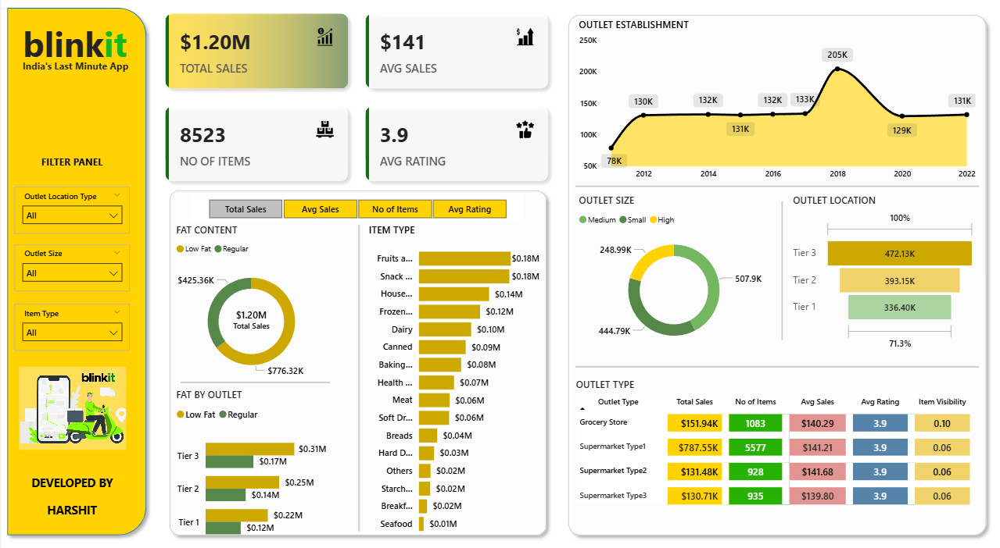

# 🚀 Blinkit Retail Dashboard – Power BI Project

> 📦 *“India’s Last Minute App” gets real-time retail intelligence!*  
> Developed and Designed by **Harshit Kumar**

---

## 📊 Project Overview

This Power BI dashboard provides **data-driven insights** for Blinkit's retail ecosystem, empowering strategic decisions with a visual overview of:

- 🛍️ **Sales performance** across outlet tiers and item categories  
- 🧊 **Fat content consumption patterns**  
- 📈 **Growth in outlet establishment over time**  
- 🗺️ **Outlet locations & size distribution**  
- ⭐ **Customer satisfaction metrics (Average Rating: 3.9)**  

Designed with **interactive filtering** for multi-dimensional retail analytics!

---

## 🌟 Key Metrics at a Glance

| Metric              | Value       |
|---------------------|-------------|
| 💰 Total Sales       | $1.20M      |
| 🛒 Number of Items   | 8523        |
| 📦 Avg Sales/Item    | $141        |
| ⭐ Avg Customer Rating | 3.9        |

Filtered View Snapshot:
| Metric              | Value       |
|---------------------|-------------|
| 💰 Total Sales       | $248.99K    |
| 🛒 Number of Items   | 1753        |
| 📦 Avg Sales/Item    | $142        |
| ⭐ Avg Customer Rating | 3.9        |

---

## 📌 Dashboard Features

### 🎯 Filters Panel
- Outlet Location Type (Tier 1/2/3)
- Outlet Size (Small/Medium/High)
- Item Type (Snacks, Dairy, etc.)

### 📉 Visual Components
- Donut Chart: Sales by **Fat Content**
- Bar Graph: Sales by **Item Type**
- Line Chart: **Outlet Establishment Growth** (2011–2022)
- Horizontal Bars: **Outlet Location & Size Sales Comparison**
- Tabular View: Outlet Type Performance (Grocery, Supermarket)

### 🔍 Performance Highlights
- 🥇 **Tier 3 outlets** generate the highest sales (~$472K)
- 🧃 **Low Fat** products dominate sales (~$776K)
- 🛒 Top performing categories: Snacks, Fruits, Household
- 🏪 Supermarket Type1 has **highest item count (1520)**

---

## 📷 Images

### 🔹 Full Dashboard View

### 🔹 Filtered Retail Insights

---

## 📁 Files Included

| File Name        | Description                          |
|------------------|--------------------------------------|
| `Dashboard1.png` | Full retail analytics dashboard      |
| `Dashboard2.png` | Filtered insights dashboard          |
| `README.md`      | GitHub documentation                 |
| `BLINKIT_PROJECT.pbix`|Original File                    |
---

## 🧠 What I Learned

- ⚡ Built interactive Power BI visuals using **DAX & slicers**
- 📚 Gained experience in **retail data modeling & KPI tracking**
- 🎨 Enhanced dashboard storytelling with clean UI & data hierarchy

---

## 🔮 Future Enhancements

- Real-time Power BI Service integration  
- Advanced segmentation by **user behavior & purchasing trends**  
- AI-powered forecasting with Power BI's **AutoML** tools  

---

## 📬 Contact

## 👨‍💻 Developed by: **Harshit Kumar**

🎓 Final-Year Undergraduate | 🎯 Data Enthusiast | 💻 SQL • Python • Power BI  
📍 NIT Patna | 📬 harshitk.nitp@gmail.com  
🔗 [LinkedIn](https://www.linkedin.com/in/harshit-kumar-32bbb7271) 
> *Let’s connect and build something impactful together!* 🚀

---

⭐ **If you liked this project, don’t forget to give it a star!** ⭐

